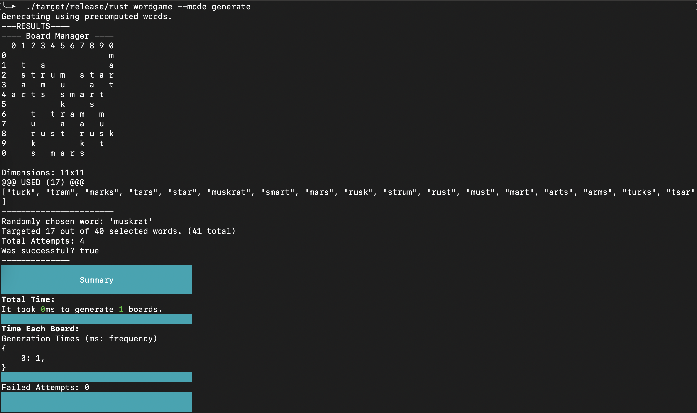
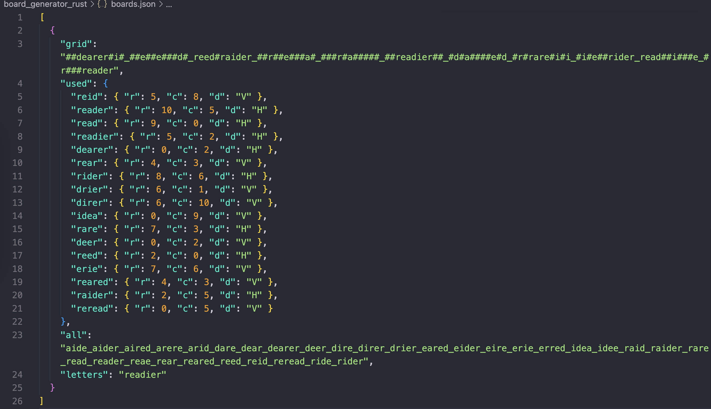
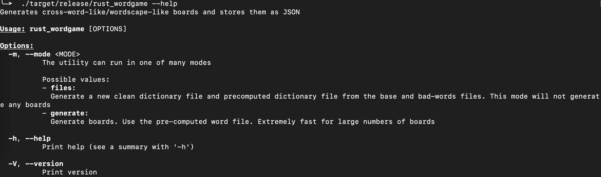
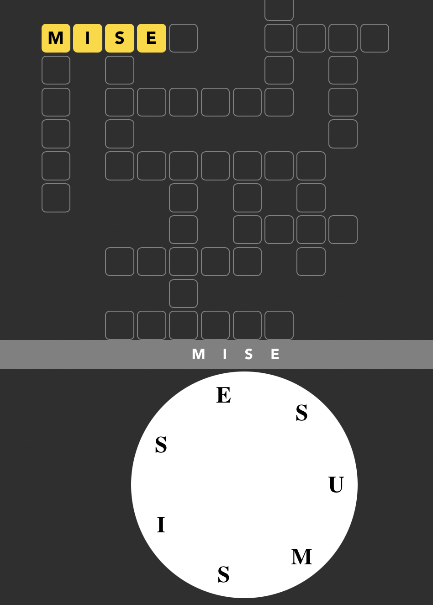

# Rust Word Game Generator _(by Captainlonate)_

This is a Rust cli tool. It generates random _WordScapes-like_ boards, with a bunch of added rules:

- The generated boards must be square in shape
- The generated boards must all have at least one 7-letter word
- The generated boards Must be very random. Even if two boards have the same 7-letter starting word, they still should be different boards.
  - Each board must have random numbers of words. Even though some letters can produce 100+ words, the generated boards won't use all of them. The specific words chosen, the number of words chosen, and how they're arranged should be different each time.
- The words can only be 4-7 letters in length. No simple short words, and no long words.
- The words should never be "bad words"
- The words should be mostly common, and pretty simple. The average english speaker should recognize most of them. Try to remove words that don't even look like real words. And try to remove locations, names and odd words like medical terminology.

The generated boards will be written to a `boards.json` file. From here they can be included in a UI application to actually build the game around it. The CLI tool can also print the board and it's metadata to the console.

Currently, this Rust CLI tool is capable of generating 10,000 unique boards, in 14 seconds. It can be faster or slower depending on how I tweak the rules. For instance, if I allow the board to have up to 20 words, then it takes 14 seconds. If I only allow 17 words, then it takes only 2 seconds _(to generate 10,000 boards)_.

---

### Examples

Here is what a generated board can look like, when printed to the console.



Here is what a generated board can look like, when written to the `boards.json` file.
Each board is represented by a string. A `#` is an empty cell, and a `_` separates each row.



---

### Commands

```
# Check for linting
cargo clippy

# Windows, measure execution time
Measure-Command { .\target\release\rust_wordgame.exe | Out-Default }

# Process new files
cargo build --release && ./target/release/rust_wordgame --mode process-files

# Solve for some letters
./target/release/rust_wordgame --mode solve --letters tpalop
```

---

### Help Command

My CLI tool supports the `--help` flag, to explain how to use it.



---

### Bugs

- Mise & Mises can both be horizontal and overlap.
  - [bug](./src/board/board_manager.rs#L400)
```json
{
  "grid": "#######e###_mises##mess_u#e####u#e#_s#issues#m#_s#s######i#_e#misuses##_s###e#u#u##_####i#miss#_##muses#s##_####m######_##misuse###",
  "used": {
    "miss": { "r": 7, "c": 6, "d": "H" },
    "seisms": { "r": 5, "c": 4, "d": "V" },
    "mises": { "r": 1, "c": 0, "d": "H" },
    "semi": { "r": 1, "c": 9, "d": "V" },
    "mise": { "r": 1, "c": 0, "d": "H" },
    "seism": { "r": 1, "c": 2, "d": "V" },
    "issues": { "r": 3, "c": 2, "d": "H" },
    "misuse": { "r": 10, "c": 2, "d": "H" },
    "misuses": { "r": 5, "c": 2, "d": "H" },
    "sums": { "r": 5, "c": 6, "d": "V" },
    "musses": { "r": 1, "c": 0, "d": "V" },
    "mess": { "r": 1, "c": 7, "d": "H" },
    "issue": { "r": 3, "c": 2, "d": "H" },
    "muses": { "r": 8, "c": 2, "d": "H" },
    "emus": { "r": 0, "c": 7, "d": "V" },
    "uses": { "r": 8, "c": 3, "d": "H" },
    "suss": { "r": 5, "c": 8, "d": "V" }
  },
  "all": "emus_issue_issues_mess_mise_mises_miss_misses_misuse_muse_muses_musses_seism_seisms_semi_sess_sues_sums_susie_suss_uses",
  "letters": "misuses"
}
```

