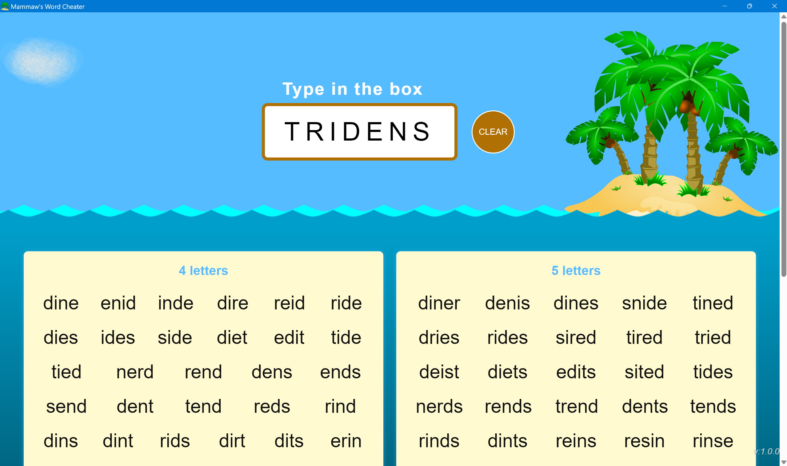

# Find All Words For Some Letters

Given 4-7 letters... produce all of the 4-7 letter words that can be constructed from those letters. If you got stuck on a "WordScapes" board, you could use this to cheat.

This is a desktop application built with Tauri _(Rust)_, Vite and ReactJS _(TypeScript)_.



## Some commands

**To run it in dev mode**

```bash
# cd into this directory. It seems that you need to have this folder
# opened as the root in vscode, in order for prettier and auto save to work

# Installs the javascript packages
npm install
# Uses cargo and then launches the desktop application
npm run tauri dev
```

**To build it**

```bash
# Will produce executables in the target/release directory
npm run tauri build
```

**To generate new icons**

```bash
# Will generate all the icons into /src-tauri/icons/
npm run tauri icon ./assets/icon_images/PalmTree_square.png
```

## The algorithm

_Is freaken fast!_

Rather than search a basic dictionary.txt, I've created a precomputed/preprocessed dictionary file and I use that instead.

The pre-processed [dictionary file](./src/data/sortedUniqueLettersJson.ts) is pretty clever. I've tested probably 15 different algorithms for fast lookups, which included benchmarks of 10,000 lookups using entire dictionaries as test input for the letters. I landed on this solution as the fastest so far.

**To create the pre-processed dictionary file:**

- I take every dictionary word and sort the letters. Then, I keep only the unique letters in that word.
- Then I create a map of those sorted & unique letters, to an array of all the words that can be built from those sorted unique letters.
- Then I write that to a file.

**The lookup algorithm:**

- Obviously I read in the pre-processed dictionary file one time when the app starts up.
- When the user types in some letters, then I find the sorted and unique letters (just like before).
- Next, I find the "Power Set" of those sorted & unique letters. That's like every possible combination and subcombination of the letters. So ` "abc"`` would be:  `['a', 'b', 'c', 'ab', 'ac', 'bc', 'abc']`.
- Then I just do a O(1) lookup in that pre-processed dictionary for each of the subcombinations, and deduplicate the results.
