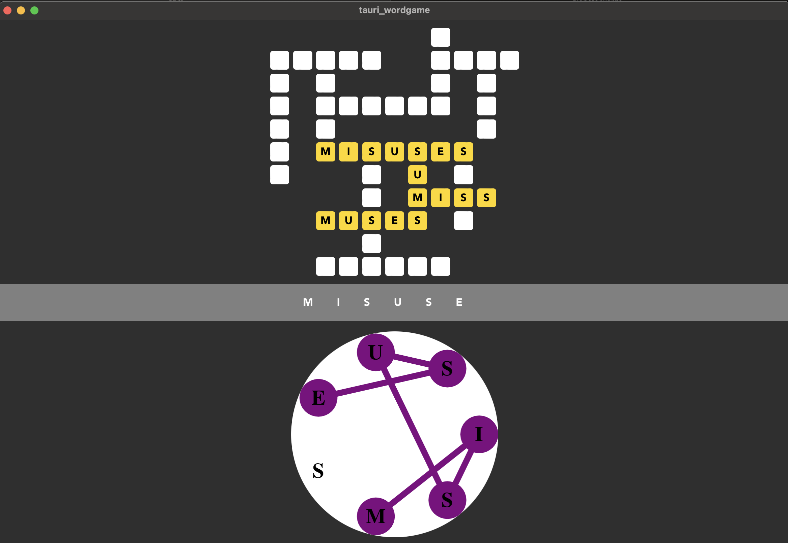
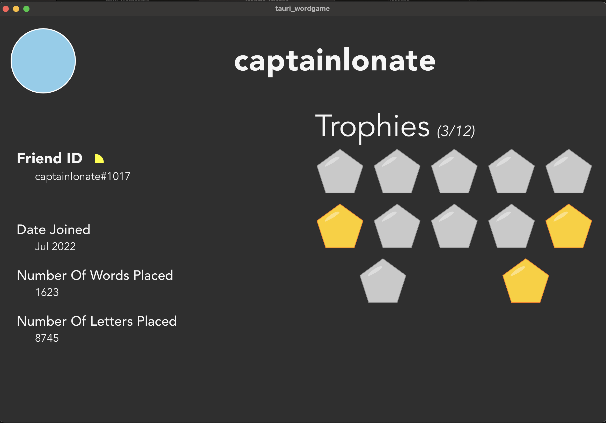

# WordScapes-like Clone

This is a desktop application built with Tauri (Rust), Vite, and ReactJS (Typescript). It is an in-progress clone of WordScapes _(but I had some extra ideas for how the game could play)._

- First, I thought it'd be cool if the player could earn funny trophies as they play
- Next, I wanted to have a way to cheat when the player gets stuck
- I want this to be playable alone, offline. But, I thought it'd be neat to have a friends list. Anyone on your friends list could pop into your board, and help you solve it. Then the two of you could play together.
- The boards should feel random (any two players on the same "board number" should have different boards, unless one is a friend joining another's session)

It's still work in progress, so it definitely looks bad.




## Commands

```
npm run tauri dev
npm run tauri build
```